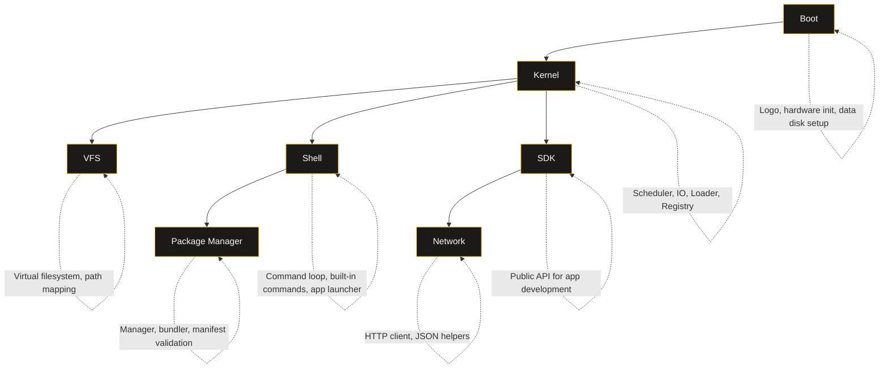

## Architecture

pyComputer is organized into several subsystems that initialize in sequence at boot.

### Subsystems

### Initialization Order

1. `ensure_data_dir()` — copies `root/` to `data/` if `data/` does not exist (atomic staging)
2. `_load_settings()` — loads theme and user preferences
3. `Kernel()` — creates all subsystems
4. `kernel.initialize()` — prints init messages
5. `kernel.boot_sequence()` — renders logo and hardware logs
6. `kernel.launch_shell()` — starts shell event loop
7. `asyncio.run(kernel.run())` — main async event loop
