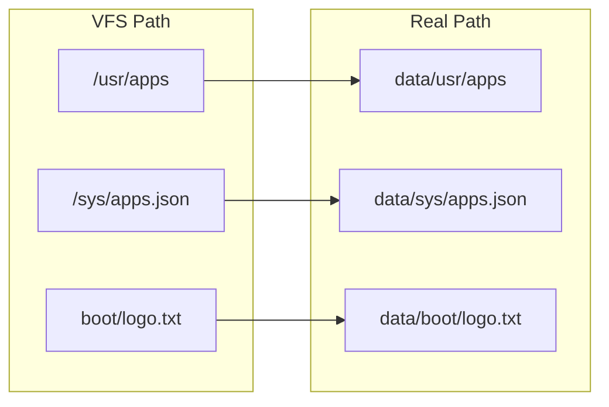

## Core Concepts

### Golden Master & Data Disk

pyComputer has a two-disk model:

- `root/` - The **golden master**. Version-controlled, read-only at runtime. Contains pre-installed apps, system config, boot assets.
- `data/` - The **runtime disk**. Created fresh from the golden master on first boot. All runtime modifications (installed apps, settings) go here.

This means you can always reset to factory state by deleting `data/`.

### Virtual Filesystem (VFS)

The VFS is a thin wrapper around the real filesystem. It maps VFS paths (like `usr/apps`) to real paths under `data/`. Apps use the VFS to read/write files without knowing where they are stored.

### App Model

Apps are Python projects with a `manifest.json`. They can be:

- **Pre-installed** - shipped in `root/usr/apps/`
- **Installed** - added via `pkg install` to `data/usr/apps/`
- **Packed** - distributed as `.pycapp` archives (ZIP files)

Each app has an entry point (`main.py` by default) that exports a `main()` function. The shell's `run` command discovers and loads apps dynamically.

### Package Manager

`pkg` is the built-in package manager. It handles:

- `pkg install <path|url|name>` - install from local dir, `.pycapp` URL, or registry
- `pkg remove <name>` - uninstall
- `pkg search [term]` - browse registry
- `pkg build <name>` - create `.pycapp` archives
- `pkg registry [url]` - configure registry URL

### SDK

The `pycomputersdk` package provides the API for building standalone apps:

- `Renderer` - TUI rendering (box-drawing, themes, ANSI output)
- `get_key()`, `Key` - keyboard input handling
- `std.*` - standard library (input, info, error, confirm, dialogs)
- `VFS` - filesystem access from within apps

### Shell

The shell is a command-line interface with:

- Built-in commands (`ls`, `cat`, `edit`, `run`, `pkg`, etc.)
- Command history (via readline)
- Tab completion
- The pyc_input() function for cross-platform input
